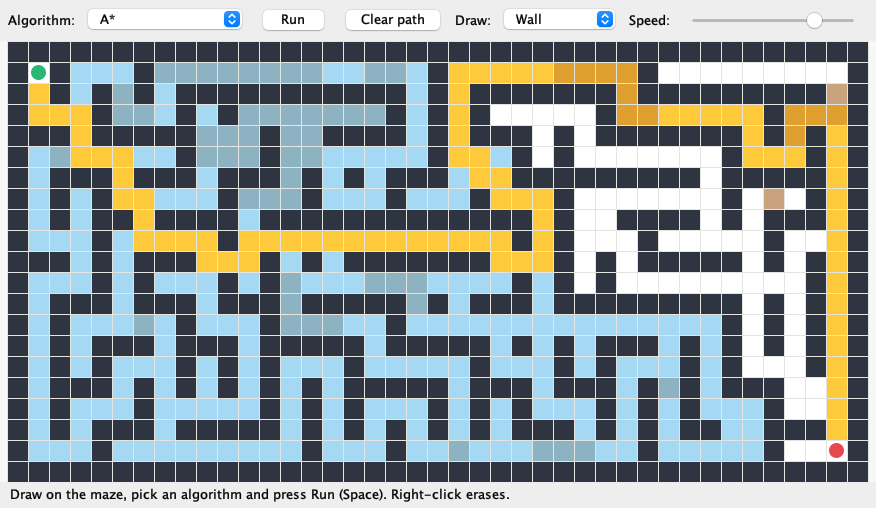

# AI Pathfinding Visualizer

[](https://github.com/Vuwori/AI-Pathfinding-Visualizer/actions/workflows/tests.yml)


An interactive Java application that visualizes how six pathfinding algorithms search through a maze, and measures how they compare.

You can watch each algorithm explore in a desktop window or in the terminal, draw your own mazes with walls and mud, generate random ones, and benchmark every algorithm across hundreds of mazes.



*A\* in the desktop app: explored cells in blue, the final path in yellow, mud in brown. The darker shades are explored or path cells that are also mud.*

---

## Features

- **Six algorithms:** BFS, DFS, Dijkstra, A\*, Greedy Best-First Search and Bidirectional BFS
- **Desktop GUI (Swing):** animated searches, adjustable speed, draw walls and mud with the mouse, move start and end, open and save mazes, compare all algorithms in a table
- **Console mode:** colored, flicker-free animation in the terminal
- **Weighted terrain:** mud costs 5 to cross, so cost-aware algorithms take detours that BFS does not
- **Maze generator:** recursive backtracker with extra loops and mud patches, reproducible from a seed
- **Maze files:** plain text format, with sample mazes in [`mazes/`](mazes)
- **Compare mode:** runs every algorithm on the same maze
- **Benchmark mode:** runs every algorithm on hundreds of random mazes and reports averages and how often each one was optimal
- **151 tests**, 70%+ line coverage enforced, CI on Linux, macOS and Windows, jars attached to tagged releases

---

## Algorithms

| Algorithm | Strategy | Shortest path? | Uses weights? |
|-----------|----------|:--------------:|:-------------:|
| Breadth-First Search | Expands cells in order of distance from the start | ✅ fewest moves | ❌ |
| Depth-First Search | Follows one branch as far as possible, then backtracks | ❌ | ❌ |
| Dijkstra | Expands the cell with the lowest cost so far | ✅ cheapest | ✅ |
| A\* | Dijkstra plus a Manhattan-distance estimate of the cost left | ✅ cheapest | ✅ |
| Greedy Best-First | Expands the cell that looks closest to the end | ❌ | ❌ |
| Bidirectional BFS | Two BFS searches, from start and end, that meet in the middle | ✅ fewest moves | ❌ |

All algorithms share one base class and report each explored cell through a `SearchListener`. That is how the same code drives the console animation, the GUI and the statistics without the algorithms knowing about any of them.

---

## Getting Started

The project is built with Maven. The included Maven Wrapper downloads Maven automatically, so only **Java 21** needs to be installed.

```bash
./mvnw package                                   # build and test (Windows: mvnw.cmd package)
java -jar target/pathfinding-visualizer.jar gui  # open the desktop app
```

Tagged versions also have a ready-built jar on the [Releases](https://github.com/Vuwori/AI-Pathfinding-Visualizer/releases) page.

### Desktop app

```bash
java -jar target/pathfinding-visualizer.jar gui
java -jar target/pathfinding-visualizer.jar gui --file=mazes/swamp.txt
```

| Action | How |
|--------|-----|
| Run or stop the search | **Run** button or <kbd>Space</kbd> |
| Clear the explored cells | **Clear path** or <kbd>Esc</kbd> |
| Draw walls or mud, move start or end | Choose a tool under **Draw**, then click or drag on the maze |
| Erase | Right-click or drag |
| New random maze | **Maze → New random maze…** (<kbd>Ctrl/⌘ N</kbd>) |
| Open or save a maze file | **Maze → Open… / Save as…** (<kbd>Ctrl/⌘ O</kbd>, <kbd>Ctrl/⌘ S</kbd>) |
| Compare every algorithm | **Analysis → Compare all algorithms** (<kbd>Ctrl/⌘ K</kbd>) |

### Console

```bash
java -jar target/pathfinding-visualizer.jar astar                            # animate A* on the example maze
java -jar target/pathfinding-visualizer.jar dijkstra --seed=42 --mud=0.2     # random maze with mud
java -jar target/pathfinding-visualizer.jar compare --file=mazes/swamp.txt   # compare on a maze file
java -jar target/pathfinding-visualizer.jar benchmark --runs=500 --mud=0.2   # average over 500 mazes
```

Commands: `bfs`, `dfs`, `dijkstra`, `astar`, `greedy`, `bidirectional`, `compare`, `benchmark`, `gui`.

| Option | Description |
|--------|-------------|
| `--file=PATH` | Load a maze from a text file |
| `--random` | Use a randomly generated maze instead of the example maze |
| `--seed=N` | Generate the random maze from a fixed seed (implies `--random`) |
| `--size=RxC` | Size of the random maze, e.g. `21x41` (default `15x31`) |
| `--mud=F` | Share of the random maze covered in mud, from `0` to `1` (default `0`) |
| `--delay=MS` | Milliseconds between animation frames (default `100`) |
| `--runs=N` | Number of mazes for `benchmark` (default `100`) |
| `--no-color` | Print without colors (also off when output is piped or `NO_COLOR` is set) |

Random runs print their seed, so any interesting maze can be reproduced later.

---

## Results

### One maze: why weights matter

[`mazes/swamp.txt`](mazes/swamp.txt) puts a swamp between start and end, with a bridge in the middle:

```text
###############################
#.S...........................#
#.............................#
#~~~~~~~~~~~~...~~~~~~~~~~~~~~#
#~~~~~~~~~~~~...~~~~~~~~~~~~~~#
#~~~~~~~~~~~~...~~~~~~~~~~~~~~#
#~~~~~~~~~~~~...~~~~~~~~~~~~~~#
#~~~~~~~~~~~~...~~~~~~~~~~~~~~#
#~~~~~~~~~~~~...~~~~~~~~~~~~~~#
#~~~~~~~~~~~~...~~~~~~~~~~~~~~#
#.............................#
#.E...........................#
###############################
```

```text
| Algorithm         | Path length | Path cost | Cells explored |
|-------------------|-------------|-----------|----------------|
| BFS               |          10 |        38 |             75 |
| DFS               |         290 |      1018 |            291 |
| Dijkstra          |          32 |        32 |            224 |
| A*                |          32 |        32 |             80 |
| Greedy Best-First |          10 |        38 |             11 |
| Bidirectional BFS |          10 |        38 |             51 |
```

BFS finds the path with the fewest moves straight through the mud. Dijkstra and A\* walk three times as far to the bridge because it is cheaper, and A\* gets there exploring about a third of the cells Dijkstra needs.

### 500 mazes: the averages

`benchmark --runs=500 --size=21x41 --mud=0.2` (seeds 1 to 500):

```text
| Algorithm         | Avg length |  Avg cost | Optimal |  Avg explored |
|-------------------|------------|-----------|---------|---------------|
| BFS               |       77.0 |     138.4 |     27% |         390.8 |
| DFS               |      118.9 |     215.6 |      2% |         187.5 |
| Dijkstra          |       82.3 |     122.7 |    100% |         372.2 |
| A*                |       82.3 |     122.7 |    100% |         288.9 |
| Greedy Best-First |       91.2 |     165.9 |      8% |         116.1 |
| Bidirectional BFS |       77.0 |     138.1 |     27% |         311.6 |
```

*Optimal* is how often an algorithm's path was as cheap as the best path found.

- **Dijkstra and A\*** were optimal in every maze, and A\* explored 22% fewer cells to get there. Without mud the saving grows to 41% (227 against 388 cells).
- **BFS and Bidirectional BFS** found the fewest moves but ignored the mud, so only 27% of their paths were the cheapest. Bidirectional BFS found the same paths as BFS while exploring 20% fewer cells.
- **Greedy Best-First** explored by far the fewest cells, but its paths were 35% more expensive on average.
- **DFS** was almost never optimal. Its paths were 76% more expensive than the best.

Run times are well under a millisecond per search and vary between machines, so the tables leave them out. `compare` and `benchmark` print them.

---

## Maze Files

Mazes are plain text, using the same symbols the console prints:

| Symbol | Meaning |
|--------|---------|
| `S` / `E` | Start / end (exactly one of each) |
| `#` | Wall |
| `.` | Empty cell (cost 1) |
| `~` | Mud (cost 5) |
| `2`–`9` | A cell with that cost |
| `*` / `P` | Visited / path; read back as empty, so search output can be pasted in |

Lines starting with `;` are comments. The [`mazes/`](mazes) folder has an example maze, the swamp, a cup-shaped trap for greedy searches and a spiral.

---

## Testing

```bash
./mvnw verify    # runs the tests and writes a coverage report to target/site/jacoco
```

The 151 JUnit 5 tests cover:

- **Every algorithm:** valid paths (start to end, one step at a time, never through walls), unreachable ends, missing start or end, and that each explored cell is reported exactly once
- **Optimality:** BFS, Bidirectional BFS, Dijkstra and A\* find the shortest path. Dijkstra and A\* find the cheapest path through mud and match each other on random mazes. A\* never explores more cells than Dijkstra.
- **Maze generation:** fully connected, surrounded by walls, reproducible from a seed, the requested amount of mud. Without loops the maze is a tree.
- **Maze files:** every symbol, comments, error messages, and a save-and-load round trip. Every sample maze is checked to be solvable by every algorithm.
- **Console and GUI:** colors, animation frames, cell hit-testing, painting and editing tools. GUI tests draw into images in headless mode, so they run in CI.
- **Command line:** every option, invalid input, and end-to-end runs of each mode

GitHub Actions runs the suite on **Linux, macOS and Windows** for every push and pull request, enforces at least 70% line coverage and uploads the coverage report. Pushing a `v*` tag builds the jar and publishes it as a release.

---

## Project Structure

```
AI-Pathfinding-Visualizer/
├── pom.xml
├── mvnw / mvnw.cmd
├── mazes/                     sample maze files
├── docs/                      screenshot
├── .github/workflows/         tests (3 operating systems) and releases
│
└── src/main/java/
    ├── algorithms/
    │   ├── PathfindingAlgorithm.java   base class: validation, path rebuilding
    │   ├── SearchListener.java         callback for every explored cell
    │   ├── Algorithms.java             registry of all algorithms
    │   ├── BFS.java
    │   ├── DFS.java
    │   ├── Dijkstra.java
    │   ├── AStar.java
    │   ├── GreedyBestFirst.java
    │   └── BidirectionalBFS.java
    │
    ├── analysis/
    │   ├── AlgorithmComparison.java    one maze, every algorithm
    │   └── Benchmark.java              many mazes, averaged
    │
    ├── maze/
    │   ├── Cell.java, CellType.java, Maze.java
    │   ├── MazeGenerator.java          recursive backtracker, loops, mud
    │   └── MazeParser.java             text file format
    │
    ├── renderer/
    │   ├── MazeRenderer.java           plain and colored text
    │   └── ConsoleAnimation.java
    │
    ├── gui/
    │   ├── VisualizerWindow.java       window, menus, background search
    │   ├── MazePanel.java              drawing and hit-testing
    │   ├── EditTool.java               wall, mud, erase, move start or end
    │   └── ComparisonDialog.java
    │
    ├── cli/
    │   └── Options.java                command-line parsing
    │
    └── Main.java
```

Tests mirror the same packages under `src/test/java/`.

---

## Technologies

- Java 21 (records, switch expressions, text blocks, pattern matching)
- Swing for the desktop GUI, with `SwingWorker` for background searches
- Maven, JUnit 5 with parameterized tests, JaCoCo
- GitHub Actions: cross-platform test matrix, coverage summary, release workflow
- Graph search: BFS, DFS, Dijkstra, A\*, Greedy Best-First, Bidirectional BFS
- Admissible heuristics and weighted graphs
- Procedural maze generation with reproducible randomness
- Queues, stacks, priority queues, hash maps and hash sets
- ANSI terminal graphics

---

## Future Improvements

- Diagonal movement with an octile-distance heuristic
- Jump Point Search for faster A\* on open grids
- Showing the open set (frontier) in a separate color
- Exporting search animations as GIFs

---

## Learning Outcomes

This project demonstrates:

- Uninformed and informed graph search, and why each algorithm behaves the way it does
- Choosing a heuristic that keeps A\* optimal
- Separating algorithms from presentation with listeners (one algorithm, three front ends)
- Measuring algorithm performance with reproducible experiments
- Thread-safe GUI updates with Swing
- Testing GUI code without a display
- Continuous integration, coverage and release automation
- Software development with Git

---

## Author

**Vanessa Amtmann**
